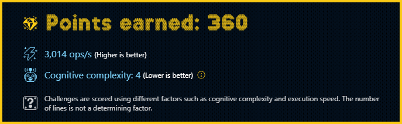

# Challenge 09

They are turning on the **Christmas lights** 🎄 in the city and, as every year, they have to be fixed!

The lights are of two colors: 🔴 and 🟢 . For the effect to be appropriate, **they must always alternate**. That is, if the first light is red, the second must be green, the third red, the fourth green, etc.

We have been asked to write a function `adjustLights` that, given an array of strings with the color of each light, return the **minimum number** of lights that need to be changed for the colors to alternate.

```js
adjustLights(['🟢', '🔴', '🟢', '🟢', '🟢'])
// -> 1 (you change the fourth light to 🔴)

adjustLights(['🔴', '🔴', '🟢', '🟢', '🔴'])
// -> 2 (you change the second light to 🟢 and the third to 🔴)

adjustLights(['🟢', '🔴', '🟢', '🔴', '🟢'])
// -> 0 (they are already alternating)

adjustLights(['🔴', '🔴', '🔴'])
// -> 1 (you change the second light to 🟢)
```

### Solutions

- [TypeScript](./solution.ts)

## Points earned


